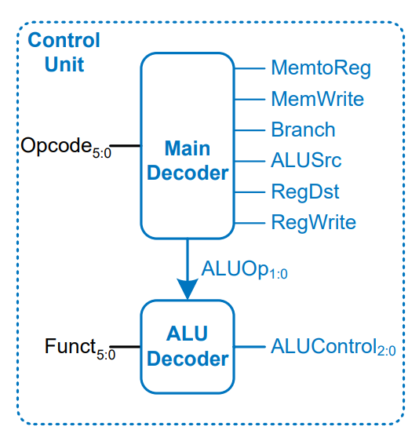

# **Control Unit for MIPS Processor**
The **Control Unit** is responsible for generating control signals for various components of the processor, such as ALU, Memory, and Registers. It consists of two main components:
1. **Main Decoder**: Generates high-level control signals based on the `Opcode`.
2. **ALU Decoder**: Determines the `ALUControl` signal using `ALUOp` and `Funct` field.

Control Unit

Refer to the **Control Unit Verilog file**:  
📄 **[ControlUnit.v](./ControlUnit.v)**
---

## **1. Main Decoder**
The **Main Decoder** takes the **Opcode** as input and generates the following control signals:
- `RegWrite`: Enables writing to the register file.
- `RegDst`: Determines destination register for R-type instructions.
- `ALUSrc`: Chooses between register and immediate operand.
- `Branch`: Enables branch instructions.
- `MemWrite`: Enables memory write operation.
- `MemtoReg`: Selects ALU result or memory data for writing to register.
- `ALUOp`: Determines the ALU operation type.

### **Main Decoder Truth Table**
| Instruction | Opcode  | RegWrite | RegDst | ALUSrc | Branch | MemWrite | MemtoReg | ALUOp |
|------------|--------|----------|--------|--------|--------|----------|----------|-------|
| **R-type** | 000000 | 1        | 1      | 0      | 0      | 0        | 0        | 10    |
| **lw**     | 100011 | 1        | 0      | 1      | 0      | 0        | 1        | 00    |
| **sw**     | 101011 | 0        | X      | 1      | 0      | 1        | X        | 00    |
| **beq**    | 000100 | 0        | X      | 0      | 1      | 0        | X        | 01    |

### **Main Decoder Verilog Code**
Refer to the **Main Decoder Verilog file**:  
📄 **[MainDecoder.v](./MainDecoder.v)**

# **ALU Decoder for MIPS Processor**
The **ALU Decoder** determines the `ALUControl` signal based on:
- `ALUOp`: Control signal from the **Main Decoder**.
- `Funct`: The function field from the instruction.

## **1. ALU Decoder Truth Table**
| ALUOp | Funct   | ALUControl | Operation         |
|-------|--------|-----------|------------------|
| 00    | X      | 010       | Add (lw, sw)     |
| X1    | X      | 110       | Subtract (beq)   |
| 1X    | 100000 | 010       | Add              |
| 1X    | 100010 | 110       | Subtract         |
| 1X    | 100100 | 000       | And              |
| 1X    | 100101 | 001       | Or               |
| 1X    | 101010 | 111       | Set Less Than    |

## **2. ALU Decoder Verilog Implementation**
Refer to the **ALU Decoder Verilog file**:  
📄 **[ALUDecoder.v](./ALUDecoder.v)**

